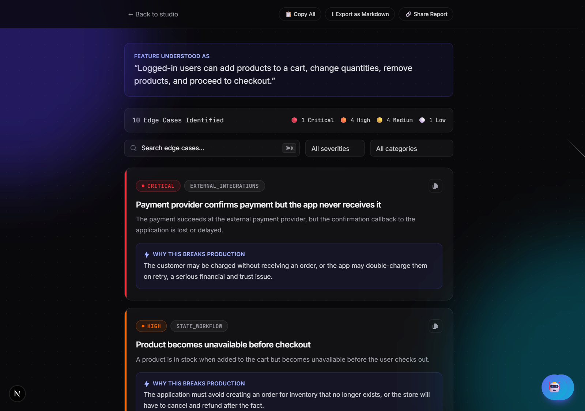

# Offpath

Find the edge cases your happy path missed.

Describe a software feature, and get back a structured, prioritized, explained list of the scenarios your description didn't account for, expired sessions, race conditions, malformed input, permission gaps, and more, generated by a **local AI model running entirely on your own machine**. No API keys, no per-request cost, no data leaving your computer.

## The problem

When people describe a feature, they usually describe the happy path: the user does the expected thing, and it works. Software also has to handle the user who double-clicks the checkout button, the file upload that gets interrupted halfway through, the invitation link that's already expired, the two admins who edit the same record at the same time.

Generic AI chat tools can list these too, but the output is usually unstructured, repetitive, and hard to scan. This tool asks a model to think like a reviewer, not a brainstorm generator: pick a category, assign a realistic severity, explain the actual consequence, and skip anything that's not a genuine deviation from the happy path.

## Screenshot



## Features

- **Local AI, zero cost.** Works with any local model server that speaks the OpenAI-compatible API — [Ollama](https://ollama.com), [LM Studio](https://lmstudio.ai), LocalAI, and others. No API key, ever.
- **Demo mode.** Try the full UI instantly with realistic canned data, no local AI setup required.
- **Structured, validated output.** Every result is checked against a [Zod](https://zod.dev) schema before it reaches the UI, so a malformed model response fails safely instead of breaking the page.
- **Categorized and severity-ranked.** Eight edge-case categories, four severity levels (Critical → Low), sorted so the most important issues surface first.
- **Search, filter, export.** Filter by severity or category, search by keyword, copy a single case or the whole report, or export the report as Markdown.
- **Built to fail gracefully.** Distinct, honest error messages for "the local AI isn't running," "the model isn't loaded," and "that took too long," instead of one generic error for everything.

## Tech stack

Next.js · React · TypeScript · Tailwind CSS · Zod

No database. No authentication. No paid APIs.

## Architecture

```
                    Browser
                       │
                       ▼
                    Next.js
                       │
                       ▼
              POST /api/generate
                       │
                       ▼
              generateEdgeCases()
                       │
                 ┌─────┴─────┐
                 │           │
                 ▼           ▼
          Demo Provider   Local AI Provider
           (canned data)        │
                                 ▼
                    Local model server
              (Ollama, LM Studio, etc. —
             OpenAI-compatible chat API)
                 │           │
                 └─────┬─────┘
                       ▼
                Zod validation
                       │
                       ▼
                Structured result
                       │
                       ▼
                React interface
```

The browser never talks to the local AI server directly, every request goes through the Next.js server first. This is what makes it safe to run: the local AI server is only ever reachable from your own machine's backend code, not from arbitrary JavaScript in the page.

## Getting started

### 1. Clone and install

```bash
git clone <your-repo-url>
cd offpath
npm install
```

### 2. Configure environment

```bash
cp .env.example .env.local
```

By default, `AI_MODE=demo`, so the app works immediately with no further setup.

### 3. Run it

```bash
npm run dev
```

Open [http://localhost:3000](http://localhost:3000) (or whatever port is printed in the terminal).

## Demo mode

This is the default. Describe any feature and you'll get one of a few realistic, hand-written example reports back, matched loosely by keyword (try mentioning "cart," "upload," or anything else, otherwise you'll get the password-reset example). No local AI tool, no download, no wait.

## Local AI mode

To get real, dynamic generation for whatever feature you describe, run a local AI server and point the app at it.

**Option A — Ollama**

```bash
ollama pull qwen3:4b
ollama serve
```

**Option B — LM Studio**

Download a model in the LM Studio app (or via its `lms get` CLI), load it, and start its local server (Developer tab → Start Server, or `lms server start`).

**Then, in `.env.local`:**

```env
AI_MODE=local
LOCAL_AI_BASE_URL=http://localhost:11434   # LM Studio defaults to :1234
LOCAL_AI_MODEL=qwen3:4b                    # must match a model you've downloaded
```

Restart `npm run dev` and generate again. The exact same UI and validation now runs against your real local model.

## Known limitations

- **Local generation can be genuinely slow**, especially without a GPU. During development, a 4B parameter model on CPU-only hardware took 158–240+ seconds to generate one full report. This is a real property of running AI locally, not a bug, larger or GPU-accelerated setups will be faster.
- **Output quality depends on which model you use.** Smaller, faster models trade off some reasoning quality; if results feel generic or repetitive, try a larger model.
- **AI output isn't perfectly consistent between runs.** The same feature description can produce a different mix of edge cases each time (sampling variance), and results should always be reviewed by a human, not treated as an exhaustive checklist.
- **Local AI tools don't all behave identically.** For example, Ollama returns a clear error if the configured model isn't downloaded; LM Studio doesn't validate the model name at all and will silently answer using whatever model is currently loaded. If results seem to be coming from the wrong model, double-check what's actually loaded in your local AI tool.

## Deployment

Because "local AI" means the app talks to `localhost` on your own machine, a cloud-hosted deployment (Vercel or otherwise) **cannot** reach a local AI server, there is no way for a server in the cloud to reach a model running on a visitor's laptop. A cloud deployment can only meaningfully run in **Demo Mode** (`AI_MODE=demo`). Real local-AI generation is something you run yourself, that's the point.

## License

[MIT](./LICENSE)
